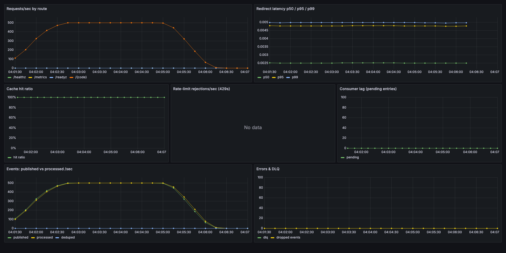
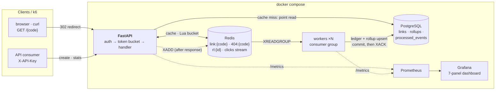
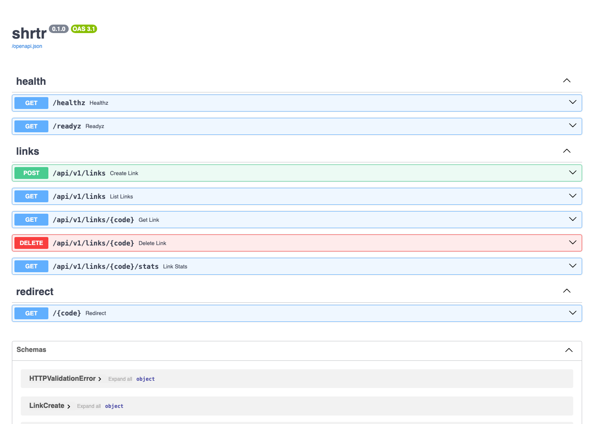

# shrtr — a rate-limited URL shortener with an async analytics pipeline

[](https://github.com/harshit-ojha0324/Rate-Limited-URL-Shortener-/actions/workflows/ci.yml)
[](LICENSE)


I built a URL shortener the way I'd want to be asked about it in an
interview: **measured, failure-tested, and honest about its limits.**
The redirect hot path is Redis cache-aside (TTL jitter, negative
caching, expiry-clamped TTLs); every API key gets a token-bucket rate
limit executed atomically in a single Redis **Lua** script; clicks flow
through a **Redis Streams consumer group** into idempotent,
effectively-once PostgreSQL rollups; and the whole thing is instrumented
with Prometheus/Grafana and load-tested with k6. One command brings up
the stack.

## The demo: 500 redirects/sec on my laptop, zero failures



*The provisioned Grafana dashboard during the committed benchmark run:
k6 ramps to 500 req/s and holds it for 3 minutes (Zipf-skewed across
10k links, `redirects: 0`). Cache hit ratio pins at ~100% once warm,
consumer lag stays at 0, the analytics pipeline processes events at
line rate, and the error/DLQ panels stay flat.*

Numbers from that run (`benchmarks/2026-07-11/`):

| Metric | Value |
|---|---|
| Requests completed | **114,000** |
| Failures (non-302 / errors) | **0 (0.00%)** |
| Sustained plateau | 500 req/s for 3 min (422 req/s avg incl. ramps) |
| Client-side latency (k6) | p50 **0.87 ms** · p90 1.26 ms · p95 1.5 ms · max 168 ms |
| Server-side p99 (histogram) | < 5 ms |
| Cache hit ratio (warm) | ~100% (99.5% including warm-up) |
| Analytics events lost | 0 · consumer lag max 0 pending |

Hardware honesty: MacBook Pro (M3 Pro), Docker Desktop VM with 11 CPUs /
8 GB; k6, the API, and every datastore share the machine over loopback.
These numbers are **evidence of architecture behavior** (cache
effectiveness, pipeline keep-up, tail shape) — **not production
capacity**. The protocol to reproduce them is below.

Reproduce it yourself — everything is local OSS containers, no accounts,
no API keys:

```bash
make up          # api, worker, postgres, redis, prometheus, grafana
make seed        # demo API key (printed once) + 20 sample links
make seed-load   # 10k links for the benchmark
make load        # the k6 run above; watch localhost:3000
```

## Architecture



The redirect hot path on a cache hit is **one Redis GET plus a
background XADD — no database session at all**. A miss is a single
point-read on the unique `short_code` index, then a cache fill whose TTL
is jittered (anti-stampede) and clamped to the link's remaining lifetime
(an expiring link can never outlive its expiry in cache). Unknown codes
are negative-cached so typo/scanner traffic can't hammer PostgreSQL.

## What I built

- `POST /api/v1/links` — create links (custom alias, optional expiry,
  timezone-validated), `GET /{code}` — 302 redirect, stats API with
  hourly/daily granularity. Interactive docs at `/docs`.
- **Token-bucket rate limiting per API key** in one atomic Redis Lua
  script (lazy refill, no background job), with `429` + `Retry-After` +
  `X-RateLimit-*` headers, a pure-Python reference implementation
  unit-tested against a frozen clock, and a deliberate failure policy:
  when Redis is down, **reads fail open, writes fail closed**.
- **Async click analytics**: events published to a Redis Stream *after*
  the response (analytics never taxes the hot path), consumed by a
  scalable consumer group, aggregated into hourly/daily PostgreSQL
  rollups.
- **Effectively-once counting**: a `processed_events` ledger insert
  (`ON CONFLICT DO NOTHING RETURNING`) shares one transaction with the
  rollup upsert, and the worker **commits before XACK** — so crashes
  cause redelivery, and redelivery cannot double-count. Stalled entries
  are reclaimed via `XAUTOCLAIM`; poison events go to a bounded DLQ.
- **Observability**: latency histograms, cache hit/miss/negative ratios,
  rate-limit decisions, consumer lag, publish/process/drop counters —
  provisioned into a 7-panel Grafana dashboard.
- **Three test tiers** (37 tests): unit (pure logic, frozen clocks),
  component (the full pipeline in one process — fakeredis-with-Lua +
  SQLite with dialect-aware upserts, including a SELECT counter that
  *proves* cache hits skip the DB), and integration (against the real
  compose stack). CI runs lint + unit + component on every push.

## Delivery semantics (the part interviewers ask about)

1. The worker reads a batch with `XREADGROUP` (entries enter the
   consumer's pending list).
2. One DB transaction: insert entry IDs into the ledger, count only the
   *newly inserted* ones into hourly buckets, upsert the rollups
   additively.
3. **Commit, then `XACK`.** A crash between the two causes redelivery;
   the ledger absorbs it.
4. A janitor pass `XAUTOCLAIM`s entries idle >60s from dead consumers;
   entries delivered >5 times go to `clicks:dlq` (bounded).

At-least-once delivery + idempotent processing = **effectively-once
counting**. I say it that way deliberately — "exactly-once delivery"
does not exist, and claiming it is an interview trap.

## What broke when I audited it

Before pushing this repo I ran a deep multi-pass audit (static review +
live failure drills + load), and it found real bugs I then fixed and
re-verified — the full list with mechanisms is in
[docs/decisions.md](docs/decisions.md), highlights:

- **The rate limiter's Redis-restart recovery was dead code.** I matched
  `"NOSCRIPT" in str(exc)`, but redis-py strips that prefix from the
  message — so after any Redis restart, writes would 503 forever. Fixed
  by catching `NoScriptError`, then proven with a live restart drill.
- **`uvicorn --workers 2` silently corrupted every metric** —
  `prometheus_client` registries are per-process, so `/metrics`
  alternated between two half-counters. I caught it because the k6
  request count didn't match the server's own counter.
- **The connection pool 500'd under burst.** At 500 req/s on one
  worker, redis-py's default 100-connection cap threw
  `MaxConnectionsError` on 60 of 113k requests (0.05%). Switched to a
  blocking pool (bursts briefly queue instead of erroring) and re-ran
  the benchmark to a clean 114k/0.
- **Expired links kept redirecting from cache** for up to ~25h past
  `expires_at`; cache TTLs are now clamped to the link's remaining
  lifetime.

## Failure modes (tested, not theorized)

| Failure | Behavior | How I verified |
|---|---|---|
| Redis restarts | limiter reloads its script transparently; fresh buckets; zero client errors | live restart drill under traffic |
| Redis fully down | cache-hit path degraded (DB fallback is `to build`); creates fail closed (503); reads fail open; event drops counted | manual drill; disclosed limitation |
| Postgres down | cache-hit redirects keep serving; creates/stats 5xx; events buffer in the stream, workers redeliver after recovery | manual drill |
| Worker killed mid-batch | unacked entries reclaimed via XAUTOCLAIM; ledger prevents double-count | component-tested logic; live kill drill |
| Poison event | parse error or >5 deliveries → bounded DLQ + ack | component test |
| Cache stampede | TTL jitter (XFetch is a documented stretch) | jitter unit-tested |
| Burst > connection pool | blocking pool queues briefly instead of 500ing | k6 before/after (60 errors → 0) |

## Quickstart

Requires Docker (for the stack) and Python 3.11+ (for the test suite).

```bash
make up          # compose defaults work out of the box; .env optional (see .env.example)
make seed        # prints a demo API key ONCE
export KEY=<printed key>

curl -X POST localhost:8000/api/v1/links -H "X-API-Key: $KEY" \
     -H "Content-Type: application/json" -d '{"long_url":"https://example.com/long"}'
curl -i localhost:8000/<short_code>          # 302
curl "localhost:8000/api/v1/links/<short_code>/stats?granularity=hour" -H "X-API-Key: $KEY"
```

- Grafana: http://localhost:3000 (dashboard "shrtr") · Prometheus:
  http://localhost:9090 · API docs: http://localhost:8000/docs

Tests:

```bash
python3 -m venv .venv && .venv/bin/pip install -e ".[dev]"
.venv/bin/pytest tests/unit tests/component -q   # 31 tests, no Docker needed
SEED_API_KEY=$KEY make itest                     # 6 integration tests vs the stack
make seed-load && make load                      # the k6 benchmark
docker compose up -d --scale worker=2            # two consumers in the group
make rollup                                      # daily rollups + ledger purge
```

<details>
<summary>API surface (OpenAPI screenshot)</summary>



</details>

## Benchmark protocol

Numbers only enter this README through this protocol: document hardware
and Docker resources; `make seed-load`; `make load` (Zipf-skewed codes,
`redirects: 0`); take p50/p90/p95 from k6 and the server-side histogram
p99 + cache ratio from Prometheus; commit the k6 summary JSON and a
Grafana screenshot to `benchmarks/<date>/`. Laptop-loopback numbers are
architecture evidence, not capacity claims — anything like "scales to
X" stays out of this repo until it's measured on real infrastructure.

## Security & privacy

API keys are stored as **SHA-256 hashes only** (high-entropy random
keys → fast hash is appropriate; bcrypt is for low-entropy passwords).
Submitted URLs are restricted to http/https with credentials-in-URL
rejected and private/loopback/link-local/reserved IP literals blocked —
including decimal/octal/hex/short-form IPv4 spellings
(`http://2130706433/` doesn't get past it). No raw IP or User-Agent is
ever stored (UA is hashed, referrer reduced to origin). Known gap,
disclosed: hostnames that *resolve* to private IPs (DNS rebinding)
aren't caught — this service never fetches target URLs server-side,
which removes the main SSRF consequence.

## Repo map

`app/` FastAPI service (api routes; core: cache/ratelimit/events;
models; schemas; observability) · `workers/` stream consumer + daily
rollup · `migrations/` Alembic · `scripts/seed.py` · `tests/` unit +
component + integration · `load/` k6 · `benchmarks/` committed runs ·
`monitoring/` Prometheus + Grafana provisioning · `docker/` Dockerfile ·
`curriculum/` a 6-stage study program built on this repo · `docs/`
decisions, architecture, verification checklist · `k8s/` stretch
placeholder

## Tradeoffs (reasoning in docs/decisions.md)

302 vs 301 (keep analytics vs client caching) · events emitted *after*
the response (hot-path latency over single-event durability — loss is
bounded and measured by `clicks_dropped_total`) · Redis Streams vs Kafka
(zero extra infra at this scale; the flip line is multi-service fan-out
or long retention) · random codes + unique-retry vs an ID sequencer
(no coordination point, non-enumerable) · one uvicorn worker per
container (per-process metric registries; scale with replicas) ·
limit/offset pagination (keyset is a stretch).

## Honestly not built (yet)

XFetch probabilistic early refresh · DB fallback when Redis is fully
down · keyset pagination · scheduled rollups · Kubernetes manifests
(`k8s/` is a placeholder README, no K8s claim) · multi-replica API
behind a reverse proxy · chaos scripts for the drills I ran manually.
Cache-aside's create/delete race windows are disclosed in
[docs/decisions.md](docs/decisions.md) with the fix design.

## License

MIT — see [LICENSE](LICENSE).
